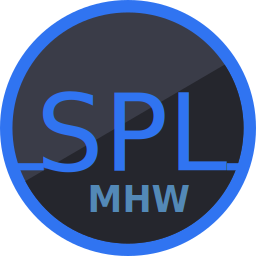

    <h1>SharpPluginLoader</h1>
    
      
    
    
    
    
    
      

A C# plugin loader for Monster Hunter World based on .NET 8.0.

For more detailed documentation and tutorials, visit the [wiki](https://fexty12573.github.io/SharpPluginLoader/).

## How to use
1. Install [.NET 8.0](https://dotnet.microsoft.com/en-us/download/dotnet/8.0) (Get the **.NET Desktop Runtime 8.0.x**)
2. Download the latest release from the [releases page](https://github.com/Fexty12573/SharpPluginLoader/releases) and extract it into your Monster Hunter World directory.

## Plugin Development
For more detailed instructions visit the [wiki](https://fexty12573.github.io/SharpPluginLoader/Development/).
1. Install the Visual Studio 2022 17.8 Preview 2 or later.
2. Create a new **.NET 8.0** class library project and add a reference to the `SharpPluginLoader.Core` NuGet package. 
3. Create a class that implements the `SharpPluginLoader.Core.IPlugin` interface.
4. Put the compiled assembly into `nativePC/plugins/CSharp`. Assemblies are also allowed to be in subdirectories.

## Framework Development (with Visual Studio 2022)
1. Clone the repository with submodules:
    1. `git clone --recursive git@github.com:Fexty12573/SharpPluginLoader.git`
2. Setup vcpkg IDE integration if you haven't already done so:
    1. Open `Developer PowerShell for Visual Studio`
    2. Run `vcpkg integrate install`
3. Generate cimgui VS project:
    1. Open `Developer PowerShell for Visual Studio`
    2. `cd SharpPluginLoader\dependencies\cimgui\`
    3. `cmake -B . -G 'Visual Studio 17 2022'`
4. Open `mhw-cs-plugin-loader.sln`
5. Build solution `Build -> Build Solution`

## **Enabling C# Debugging**
1. Make sure all projects are compiled in **Debug** mode.
2. Open the `mhw-cs-plugin-loader` project properties, make sure the **Debug** configuration is selected and go to General > Debugging. Here set the Debugger Type to **Mixed (.NET Core)**.
3. In the Attach to Process dialog, make sure **Managed (.NET Core, .NET 5+)** and **Native** are selected.

## **Hosting Docs Locally**
1. `python -m venv venv`
2. `venv\Scripts\activate`
3. `pip install -r requirements.txt`
4. `mkdocs serve`

## **Contributing**
If you would like to contribute, feel free to fork the repository and make a PR. If you would like to join the core development team you can contact me on Discord @fexty.

## **Libraries Used**
- [safetyhook](https://github.com/cursey/safetyhook) - Native hooking library
- [Reloaded.Hooks](https://github.com/Reloaded-Project/Reloaded.Hooks) - Managed hooking library
- [cimgui](https://github.com/cimgui/cimgui) - C wrapper for Dear ImGui
- [Dear ImGui](https://github.com/ocornut/imgui) - GUI library
- [ImGui.NET](https://github.com/ImGuiNET/ImGui.NET) - C# wrapper for Dear ImGui
- [tinyobjloader](https://github.com/tinyobjloader/tinyobjloader) - Wavefront OBJ loader
- [nlohmann-json](https://github.com/nlohmann/json) - C++ JSON library
- [zlib](https://www.zlib.net/) - Compression library
- [DirectXMath](https://github.com/microsoft/DirectXMath) - DirectX Math library
- [PicoSHA2](https://github.com/okdshin/PicoSHA2) - header-only SHA256 library
- [DirectXTK\[12\]](https://github.com/microsoft/DirectXTK) - DirectX Toolkit, used for loading and managing textures

## **Credits**
- Thanks to Lyra for creating the logo
